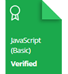

# HackerRank | Practice, Tutorials Solutions
This repository consists of solutions to HackerRank **practice (C++), 30 Days of Code (C++)** and  **10 Days of Javascript**

[View Profile](https://www.hackerrank.com/SanandhKumar)

## HackerRank Certificates

## HackerRank Badges

